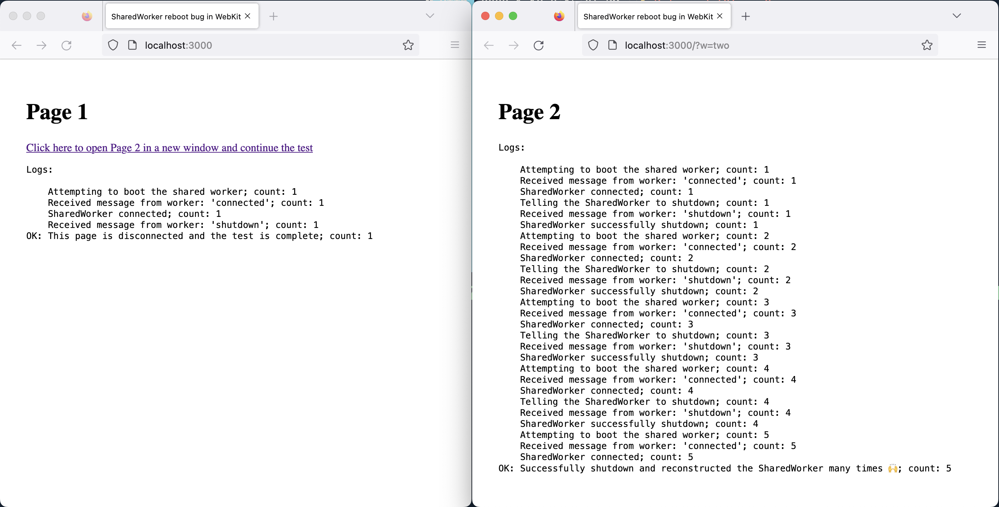
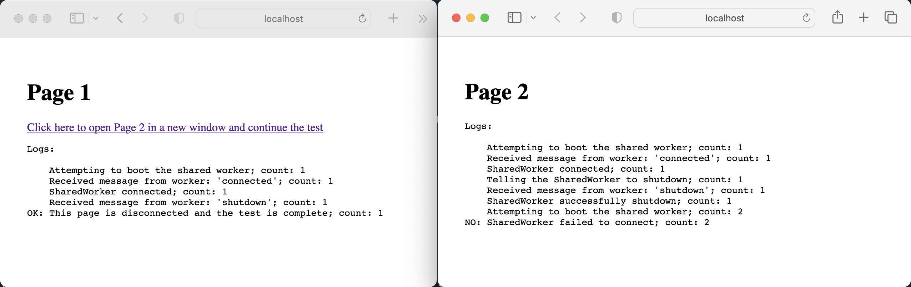

# Demonstration of a SharedWorker bug in WebKit

## Closing, then reopening a SharedWorker will connect to a broken SharedWorker until all windows referencing the original are closed

### Setup

To run a small web server so SharedWorkers are available, use any simple server you like or:

```sh
npx serve
```

which will listen on port `:3000` on `localhost` by default.

### The test

The test has two pages:

1. Navigate to the test app, ex: `http://localhost:3000/`
2. Click “Start test” to start and connect to the SharedWorker in Page 1
3. Click the link to open a new window/tab to Page 2
4. Page 2 will attempt to shutdown the SharedWorker, then restart and reconnect using `new SharedWorker()`, 5 times in a loop

It is expected that `new SharedWorker()` will always either connect to a running SharedWorker or start a new SharedWorker.

## Outcomes

**Firefox and Chrome meet this expectation correctly.** Page 2 is able to shutdown, then restart and reconnect to the SharedWorker 5 times.

In Safari and Safari Technology Preview, Page 2 is able to initially connect to the SharedWorker which was started by Page 1, but after the SharedWorker calls `self.close()` on itself, `new SharedWorker()` in any window will return a broken SharedWorker instance.

Reloading Page 2 will continually instantiate and connect to the broken SharedWorker until Page 1 is closed _(until all pages which were originally connected to the first SharedWorker are closed)_.

This means any new page/tab which attempts to `new SharedWorker()` after a SharedWorker has called `self.close()` will get a SharedWorker instance which is **undetectably unusable with no recourse.** The app must wait for the user to close all open tabs which had ever connected to the SharedWorker to get a fresh start.

Safari does not meet the expectation that `new SharedWorker()` will always either connect to a running SharedWorker or start a new SharedWorker.

### Screenshots and logs

#### Expected outcome (Firefox 108.0.2)



#### Unexpected outcome (Safari Technology Preview Release 161 16.4 WebKit 18615.1.17.6)


